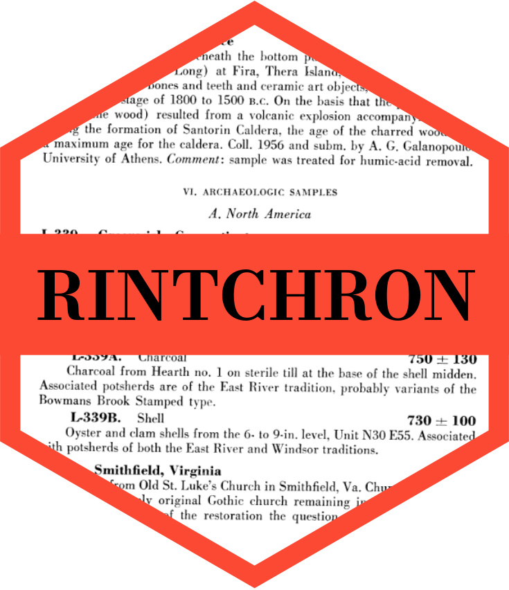

<!-- README.md is generated from README.Rmd. Please edit that file -->

```{r, include = FALSE}
knitr::opts_chunk$set(
  collapse = TRUE,
  comment = "#>",
  fig.path = "man/figures/README-",
  out.width = "100%"
)
```

# rintchron: R interface to IntChron <a href='https://rintchron.joeroe.io'></a>

<!-- badges: start -->
[](https://www.repostatus.org/#wip)
[](https://CRAN.R-project.org/package=rintchron)
[](https://github.com/joeroe/rintchron/actions/workflows/R-CMD-check.yaml)
<!-- badges: end -->

**rintchron** provides an R interface to [IntChron](https://intchron.org), an indexing service and exchange format for radiocarbon dates and other chronological data ([Bronk Ramsey et al. 2019](https://doi.org/10.1017/RDC.2019.21)).
It includes a user friendly interface for querying databases indexed by IntChron, as well as lower level functions for interacting directly with the [IntChron API](https://intchron.org/schema).

For an introduction to querying IntChron's databases see the [basic usage vignette](https://rintchron.joeroe.io/articles/rintchron).
For advanced users, low level functions for interacting with the IntChron API directly are described in the [IntChron API vignette](https://rintchron.joeroe.io/articles/intchron_api).

## Installation

rintchron has not yet been released on CRAN.
You can install the development version from GitHub using the [remotes](https://remotes.r-lib.org/) package: 

```{r intchron-install, eval=FALSE}
# install.package("remotes")
remotes::install_github("joeroe/rintchron")
```

## Usage

Use [`intchron()`](https://rintchron.joeroe.io/reference/intchron) to query databases indexed by IntChron.
You can refine the query by database (use `intchron_hosts()` to see what's available) and optionally by country and site.
For example, to download records from Jordan in the ORAU and NERC Radiocarbon Facility databases:

```{r intchron-basic}
library("rintchron")

# List available databases
intchron_hosts()

# Query IntChron
intchron(c("oxa", "nrcf"), countries = "Jordan")
```
