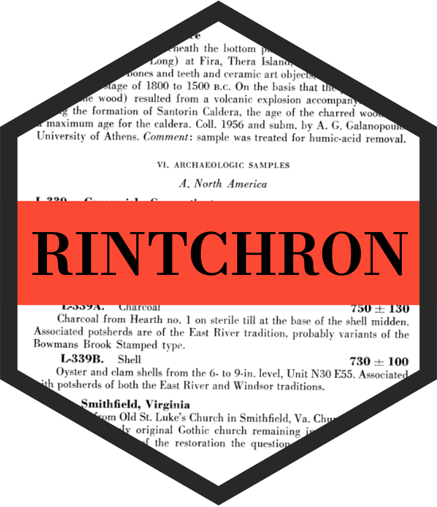

<!-- README.md is generated from README.Rmd. Please edit that file -->

# rintchron: R interface to IntChron <a href='https://rintchron.joeroe.io'></a>

<!-- badges: start -->

[](https://www.repostatus.org/#wip)
[](https://CRAN.R-project.org/package=rintchron)
[](https://github.com/joeroe/rintchron/actions/workflows/R-CMD-check.yaml)
<!-- badges: end -->

**rintchron** provides an R interface to
[IntChron](https://intchron.org), an indexing service and exchange
format for radiocarbon dates and other chronological data ([Bronk Ramsey
et al. 2019](https://doi.org/10.1017/RDC.2019.21)). It includes a user
friendly interface for querying databases indexed by IntChron, as well
as lower level functions for interacting directly with the [IntChron
API](https://intchron.org/schema).

For an introduction to querying IntChron’s databases see the [basic
usage vignette](https://rintchron.joeroe.io/articles/rintchron). For
advanced users, low level functions for interacting with the IntChron
API directly are described in the [IntChron API
vignette](https://rintchron.joeroe.io/articles/intchron_api).

## Installation

rintchron has not yet been released on CRAN. You can install the
development version from GitHub using the
[remotes](https://remotes.r-lib.org/) package:

``` r
# install.package("remotes")
remotes::install_github("joeroe/rintchron")
```

## Usage

Use [`intchron()`](https://rintchron.joeroe.io/reference/intchron) to
query databases indexed by IntChron. You can refine the query by
database (use `intchron_hosts()` to see what’s available) and optionally
by country and site. For example, to download records from Jordan in the
ORAU and NERC Radiocarbon Facility databases:

``` r
library("rintchron")

# List available databases
intchron_hosts()
#> # A tibble: 6 × 2
#>   host     database                            
#>   <chr>    <chr>                               
#> 1 egyptdb  Egyptian Radiocarbon Database       
#> 2 intimate INTIMATE Database                   
#> 3 nrcf     NERC Radiocarbon Facility (Oxford)  
#> 4 oxa      Oxford Radiocarbon Accelerator Unit 
#> 5 sadb     Southern Africa Radiocarbon Database
#> 6 intcal20 IntCal20 archive

# Query IntChron
intchron(c("oxa", "nrcf"), countries = "Jordan")
#> # A tibble: 156 × 19
#>    record_site  record_country record_name  record_longitude record_latitude
#>    <chr>        <chr>          <chr>                   <dbl>           <dbl>
#>  1 Araq ed-Dubb Jordan         Araq ed-Dubb             32.3            35.7
#>  2 Ayn Qasiyah  Jordan         Ayn Qasiyah              36.8            31.8
#>  3 Ayn Qasiyah  Jordan         Ayn Qasiyah              36.8            31.8
#>  4 Ayn Qasiyah  Jordan         Ayn Qasiyah              36.8            31.8
#>  5 Ayn Qasiyah  Jordan         Ayn Qasiyah              36.8            31.8
#>  6 Ayn Qasiyah  Jordan         Ayn Qasiyah              36.8            31.8
#>  7 Azraq 31     Jordan         Azraq 31                 36.8            31.8
#>  8 Azraq 31     Jordan         Azraq 31                 36.8            31.8
#>  9 Azraq 31     Jordan         Azraq 31                 36.8            31.8
#> 10 Burqu' 02    Jordan         Burqu' 02                37.8            32.7
#> # ℹ 146 more rows
#> # ℹ 14 more variables: series_type <chr>, labcode <chr>, longitude <dbl>,
#> #   latitude <dbl>, sample <chr>, material <chr>, species <chr>, d13C <dbl>,
#> #   r_date <int>, r_date_sigma <int>, qual <chr>, F14C <dbl>, F14C_sigma <dbl>,
#> #   refs <chr>
```
